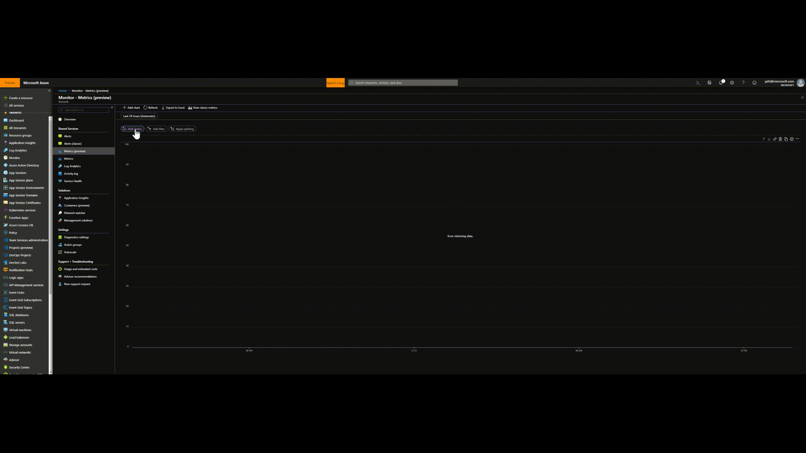

# Azure App Service Monitoring
A customer I worked  with recently had developed an application hosting platform using Azure App Service Environments for their estate of line of business Java applications. They have developed an automated build pipeline for deployment of applications onto Web Apps within these Azure App Service Environments. One of the goals of the platform is to enable complete self service of application hosting and achieve as near to No-Ops as possible to reduce any potential friction in the application delivery process. 

In order to achieve this the App Service Environment, App Service Plan and Web App itself are defined in Terraform code and deployed as part of a CICD pipeline using Jenkins. Once the PaaS layer has been provisioned, there is no need to manage the underlying network, storage or compute layers, just deployment of code and config. 

Once they had deployed a number of applications the next step was to establish monitoring processes to identify issues and opportunities to optimise the environment. 

## Services
If you know about App Service Environments, skip ahead, if not then below's an overview of the services.

### Web App
Azure Web Apps is a service for hosting web apps, APIs and mobile back ends written in .NET, .NET core, Java, Ruby, Node, PHP or Python. You don't have to worry about the underlying compute, storage or network, just deploy the application code either directly through FTP, from Visual Studio or VS Code or your favourite CICD tool (VSTS/Jenkins etc). 
[Web App Overview](https://docs.microsoft.com/en-gb/azure/app-service/app-service-web-overview)

### App Service Plan
Before you can deploy a Web App you need to create an App Service Plan which defines the size and quantity of you compute resources (called workers or instances). These workers are effectively VMs that are running under the hood and host your Web App. They can auto scale based on a range of metrics and you can host as many apps you want/can/dare to on each worker.

A little known fact that's useful to know is that when you deploy multiple Web Apps onto an App Service Plan, each and every Web App will deployed onto every App Service Plan worker instance. You can enable something called 'Per-App Scaling' which is a setting on a Web App which will limit the number of workers a Web App will scale across. For instance, if you had an App Service Plan configured with a minimum of 2 and maximum of 4 instances which is hosting 2 Web Apps, then you could turn on per-app scaling on one of the Web Apps to limit the number of instances it will run on to 2, and the other Web App could run across all 4. This is useful if you have an application that you know doesn't need a lot of resource and shouldn't need to scale out but you can still deploy it along side another Web App that does need to scale out.
[App Service Plan Overview](https://docs.microsoft.com/en-gb/azure/app-service/azure-web-sites-web-hosting-plans-in-depth-overview)
### App Service Environment
Regular Web Apps are public, meaning they use Public DNS and have a Public IP address. For customers who want to use Web Apps but have security constraints or who want to host line of business applications that should only be accessed over a private network (such as a Site to Site VPN or Express Route) then we have App Service Environments (ASE).
An ASE allows you to deploy Web Apps into your own VNET, this allows you to deploy multi tier applications onto Web Apps that never need to communicate outside of your VNET and it allows you to connect using private IPs over a VPN or ExpressRoute or through from other applications hosted in other Azure VNETs via VNET peering. 

An ASE can be external, in which case it will have a Public VIP that the applications can be reached through, or internal which will require private network connectivity to reach. In both cases there is a pool of front end wokrers that are used to terminate Http and Https traffic before sending onto the correct worker instances.
[ASE Overview](https://docs.microsoft.com/en-gb/azure/app-service/environment/intro)

## The Monitoring Plan
In order to monitor the health of the environment and identify opportunities to optimise we looked at Azure Monitor which provides performance counter metrics for Azure services and the ability to definer alert rules based on thresholds.

As we were talking about Web Apps deployed within ASEs there were three  resources of particular interest.

1. App Service 
Web App metrics showing data in/out, HTTP codes, response time, threads, memory and CPU.

2. App Service Plan 
Worker instance metrics including CPU, data in/out, memory, disk and http queue lengths

3. App Service Environment 
Front End metrics.

We used the new Azure Monitor Metrics which at the time of writing are in preview. This updated service provides the ability to overlay multiple counters on the same chart, which can help in identifying relationships between events and utilisation.

Charts for visibility, published to dashboards which will contain all the relevant charts for each party.
RBAC applied to resource groups at the ASP, Web App and Dashboard level to control who has visibility of data.

[Azure Monitor Overview](https://docs.microsoft.com/en-us/azure/monitoring-and-diagnostics/monitoring-overview-azure-monitor)

> Written with [StackEdit](https://stackedit.io/).